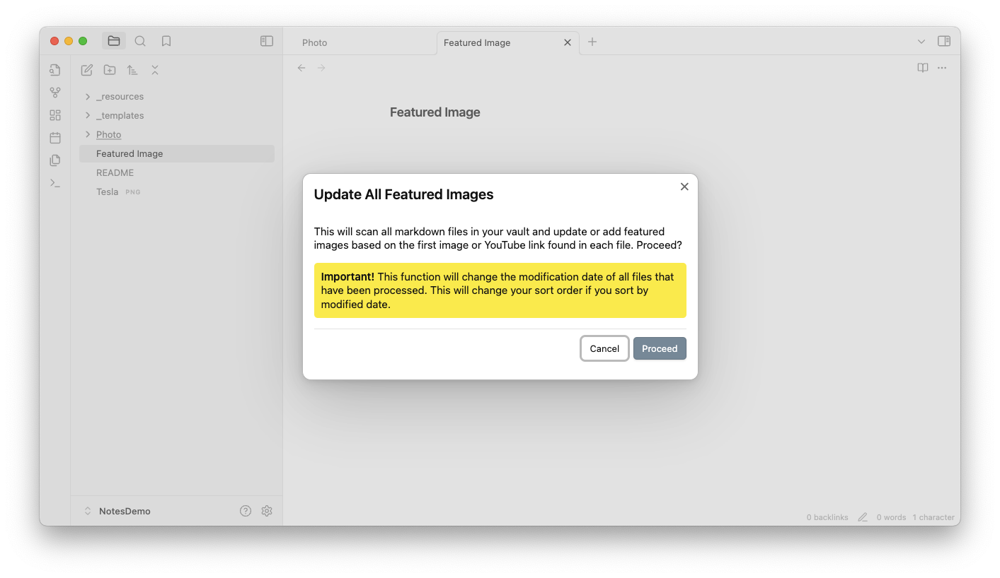

# Featured Image Plugin for Obsidian

## Introduction

Featured Image is a complementary plugin for [Notebook Navigator](https://github.com/johansan/notebook-navigator) that automatically finds and sets thumbnail images for your notes. It detects the first image, YouTube link, or [Auto Card Link](https://github.com/nekoshita/obsidian-auto-card-link) in each document and creates optimized resized thumbnails for faster loading.

When used with Notebook Navigator, your notes display with beautiful thumbnail previews in the file list, creating a rich visual browsing experience similar to Apple Notes, Evernote, and Bear. The resized thumbnails ensure smooth scrolling even with thousands of notes.


If you enjoy using Featured Image, please consider [buying me a coffee](https://buymeacoffee.com/johansan) or [Sponsor on GitHub ❤️](https://github.com/sponsors/johansan).

<a href="https://www.buymeacoffee.com/johansan" target="_blank"></a>

## Key Features

### Automatic Image Detection

- Finds the first image in each note (local files, external URLs, YouTube videos, or Auto Card Links)
- Sets a frontmatter property with the image path for use by other plugins
- Handles complex Wiki link syntax including captions and dimensions
- Works automatically as you edit notes - no manual intervention needed

### Smart Thumbnail Generation

- Creates optimized 128x128 thumbnails for fast loading in file browsers
- Configurable cropping with alignment control (top/center/bottom, left/center/right)
- Stores thumbnails separately from originals to preserve quality
- Reduces memory usage and improves scrolling performance with large vaults

### Bulk Processing

- Update your entire vault or specific folders with one command
- Preserves original file modification dates during bulk operations
- Clean up unused downloaded images to save disk space
- Re-render all thumbnails when you change size or alignment settings

### Works With Your Favorite Plugins

- **Notebook Navigator** - Display beautiful thumbnails in the file list
- **Obsidian Bases** - Show image previews in database table views (Obsidian 1.9+)
- **Dataview** - Include thumbnails in custom queries and lists
- Runs on desktop and mobile

## Installation & Setup

1. Open Obsidian Settings → Community Plugins → Browse
2. Search for "Featured Image" → Install → Enable
3. Click "Options" to configure settings (especially **Thumbnails Folder** if you want to change where images are stored)
4. The plugin automatically detects and sets featured images when you edit notes containing images, YouTube links, or Auto Card Links

## Bulk Commands

Access these commands via Command Palette (Ctrl/Cmd + P):

1. **Set featured images in all files**  
   Scans your entire vault and sets featured images based on the first image found in each note. File modification dates are preserved.

2. **Set featured images in current folder**  
   Same as above but only processes the current folder and its subfolders.

3. **Remove featured images from all files**  
   Clears all featured image properties from your vault while preserving file modification dates.

4. **Remove unused downloaded images and thumbnails**  
   Deletes downloaded images that are no longer referenced by any notes to free up disk space.

5. **Re-render all resized thumbnails**  
   Regenerates thumbnails with your current size and alignment settings.



## Settings

### Basic Settings

1. **Show Notifications** - Shows notifications when featured images are set, updated, or removed.

2. **Thumbnails Folder** - Folder where external images, YouTube thumbnails, and resized images are stored. Subfolders are created automatically.

3. **Excluded Folders** - Comma-separated list of folders to exclude from processing (e.g., `templates, archive`).

4. **Frontmatter Property** - The name of the frontmatter property for the featured image path.

### Resized Thumbnail

5. **Create Resized Thumbnail** - Creates optimized thumbnail versions of featured images for faster loading.

6. **Resized Thumbnail Frontmatter Property** - The frontmatter property for the resized thumbnail path.

7. **Max Resized Width/Height** - Maximum dimensions in pixels for resized thumbnails (0 = no restriction).

8. **Fill Resized Dimensions** - Makes thumbnails exactly the specified size by cropping if needed.

9. **Vertical/Horizontal Alignment** - Controls which part of the image is preserved when cropping.

### Advanced Settings

10. **Show Advanced Settings** - Toggle to show or hide advanced configuration options.

11. **Media Link Format** - How to format image paths in frontmatter:
    - Plain text: `path/to/image.png`
    - Wiki link: `[[path/to/image.png]]`
    - Embedded link: `![[path/to/image.png]]`

12. **Only Update if Frontmatter Property Exists** - Only updates notes that already have the featured image property.

13. **Keep Empty Property** - Keeps the property with an empty value instead of removing it when no image is found.

14. **Don't Clear Existing Property** - Preserves existing featured images when no new image is found in the document.

15. **Require Exclamation Mark for YouTube Thumbnails** - YouTube links must be prefixed with `!` to be considered.

16. **Download WebP** - Downloads WebP format for YouTube thumbnails when available.

17. **Local Image Extensions** - Comma-separated list of image file extensions to search for (e.g., `png,jpg,jpeg,gif,webp`).

18. **Debug Mode** - Logs detailed information to the console for troubleshooting.

19. **Dry Run** - Prevents any changes from being made to files (preview mode).

## Technical Details

- **Smart Caching** - Downloads external images once and stores them locally. Failed downloads use a 1x1 placeholder to prevent repeated attempts
- **YouTube Support** - Automatically downloads thumbnails with WebP and multiple JPG fallback resolutions
- **Performance** - Single-pass regex matching and Obsidian's metadata cache for fast processing
- **File Preservation** - Original modification dates remain unchanged during bulk operations
- **Automatic Organization** - Creates subfolders (youtube/, external/, autocardlink/, resized/) for different image types

### Code Quality

This plugin follows strict code quality standards using [Obsidian's official ESLint plugin](https://github.com/obsidianmd/eslint-plugin) and the build process enforces zero tolerance for errors and warnings. All TypeScript is fully typed with no explicit any, and the codebase is validated with ESLint, Prettier, and dead code detection.

## Known Issues

### Conflicts with Mousewheel Image Zoom Plugin

There is a known issue in the plugin "Mousewheel Image Zoom" when the same image name appears multiple times in a document. The following examples will not get resized:

1. When an image is mentioned in text and then used as a link:

   ```markdown
   Some text mentioning example.jpg in a paragraph
   Another paragraph

   ![[example.jpg|100]] # This link would not get resized
   ```

2. When an image is used in frontmatter and then in the document:

   ```markdown
   ---
   feature: example.jpg
   ---

   ![[example.jpg|100]] # This link would not get resized
   ```

#### Recommended Workaround

The "Image Converter" plugin offers similar functionality and has fixed this issue in version 1.2.20. Until the Mousewheel Image Zoom plugin is updated, we recommend:

1. Switch to using the "Image Converter" plugin
2. Ensure you're using version 1.2.20 or later of Image Converter

The author of Mousewheel Image Zoom has been notified of this issue, but no fix has been implemented yet.

## Support and Feedback

If you have any questions, suggestions, or issues, please open an issue on the [GitHub repository](https://github.com/johansan/obsidian-featured-image).

Enjoy using Featured Image!
