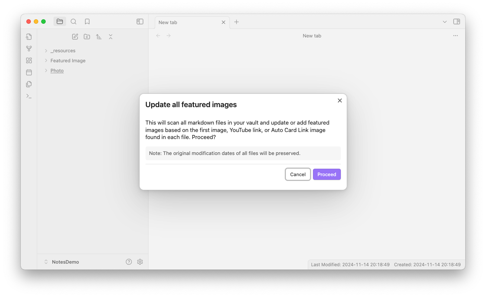

# Featured Image Plugin for Obsidian

**Available in:** English • Deutsch • Español • Français • 日本語 • 中文

Featured Image is an Obsidian plugin that automatically finds and sets thumbnail images for your notes. It detects the first image, YouTube link, or [Auto Card Link](https://github.com/nekoshita/obsidian-auto-card-link) in each document, downloads external images locally for instant loading, and creates optimized resized thumbnails.

The main use case for Featured Image is when you want a property with an image in each markdown file, typically for Bases or Dataviews.

**Important!**

> Before Notebook Navigator version 2.0 was released this was the preferred way to generate image thumbnails for Notebook Navigator. However, as of version 2.0 the thumbnail-generation is now built into Notebook Navigator and saved to a dedicated database separate from the vault.

**This means Featured Image is no longer needed for Notebook Navigator.**

If you enjoy using Featured Image, please consider [buying me a coffee](https://buymeacoffee.com/johansan) or [Sponsor on GitHub ❤️](https://github.com/sponsors/johansan).

## Key Features

### Automatic Image Detection

- Finds the first image in each note (local files, external URLs, YouTube videos, or Auto Card Links)
- Sets a frontmatter property with the image path for use by other plugins
- Handles complex Wiki link syntax including captions and dimensions
- Works automatically as you edit notes - no manual intervention needed

### Smart Thumbnail Generation

- Creates optimized 128x128 thumbnails for fast loading in file browsers
- Configurable cropping with alignment control (top/center/bottom, left/center/right)
- Stores thumbnails separately from originals to preserve quality
- Reduces memory usage and improves scrolling performance with large vaults

### Bulk Processing

- Update your entire vault or specific folders with one command
- Preserves original file modification dates during bulk operations
- Clean up unused downloaded images to save disk space
- Re-render all thumbnails when you change size or alignment settings

### Works With Your Favorite Plugins

- **Obsidian Bases** - Show image previews in database table views without network delays (Obsidian 1.9+)
- **Dataview** - Include thumbnails in custom queries with fast local image access
- Runs on desktop and mobile

## Installation & Setup

1. Open Obsidian Settings → Community Plugins → Browse
2. Search for "Featured Image" → Install → Enable
3. Click "Options" to configure settings (especially **Thumbnails Folder** if you want to change where images are stored)
4. The plugin automatically detects and sets featured images when you edit notes containing images, YouTube links, or Auto Card Links

## Bulk Commands

Access these commands via Command Palette (Ctrl/Cmd + P):

1. **Set featured images in all files**  
   Scans your entire vault and sets featured images based on the first image found in each note. File modification dates are preserved.

2. **Set featured images in current folder**  
   Same as above but only processes the current folder and its subfolders.

3. **Remove featured images from all files**  
   Clears all featured image properties from your vault while preserving file modification dates.

4. **Remove unused downloaded images and thumbnails**  
   Deletes downloaded images that are no longer referenced by any notes to free up disk space.

5. **Re-render all resized thumbnails**  
   Regenerates thumbnails with your current size and alignment settings.

## Settings

### Basic Settings

1. **Show notifications** - Show notifications when the featured image is set, updated or removed.

2. **Frontmatter property** - The name of the frontmatter property to update with the featured image.

3. **Thumbnails folder** - Folder for downloaded thumbnails and resized images. Subfolders will be created automatically for different image types.

4. **Excluded folders** - Comma separated list of folders to exclude from the featured image plugin.

### Frontmatter

5. **Frontmatter image source properties** - Comma-separated list of frontmatter properties to check for image paths/URLs before scanning the document. Supports strings and YAML lists.

6. **Media link format** - Choose how to format the featured image property in frontmatter:
   - Plain text: `path/to/image.png`
   - Wiki link: `[[path/to/image.png]]`
   - Embedded link: `![[path/to/image.png]]`

7. **Only update if frontmatter property exists** - Enable this to only update the frontmatter property if it already exists.

8. **Keep empty property** - When enabled, the frontmatter property will be kept but set to an empty string if no featured image is found. When disabled, the property will be removed.

9. **Don't clear existing property** - When enabled, keeps the existing featured image property if no image is found in the document. When disabled, clears or removes the property when no image is detected (depending on the 'Keep empty property' setting).

### External Media

10. **Download external images to thumbnails folder** - Store external image links locally. Disable to skip remote images when selecting a featured image.

11. **Download YouTube thumbnails** - Store YouTube thumbnails locally. Disable to skip YouTube links when selecting a featured image.

12. **Require exclamation mark for YouTube thumbnails** - If enabled, only YouTube links prefixed with an exclamation mark will be considered for thumbnail download.

### Resize thumbnail

13. **Resize feature image** - Resize feature image for better performance in scrolling lists.
    - **Resized thumbnail property name** - The name of the frontmatter property to store the resized thumbnail path.
    - **Max resized width** - Maximum width of the resized thumbnail in pixels. Use 0 for no width restriction.
    - **Max resized height** - Maximum height of the resized thumbnail in pixels. Use 0 for no height restriction.
    - **Fill resized dimensions** - When enabled, resized thumbnails will be exactly the size specified by max width and height, maintaining aspect ratio and cropping to fill the dimensions.
      - **Vertical alignment** - Choose the vertical alignment for cropped images (top, center, or bottom).
      - **Horizontal alignment** - Choose the horizontal alignment for cropped images (left, center, or right).

### Advanced Settings

14. **Debug mode** - Enable debug mode to log detailed information to the console.

15. **Dry run** - Enable dry run to prevent any changes from being made to your files.

## Technical Details

- **Smart Caching** - Downloads external images once and stores them locally. Failed downloads use a 1x1 placeholder to prevent repeated attempts
- **YouTube Support** - Automatically downloads thumbnails with WebP and multiple JPG fallback resolutions
- **Performance** - Single-pass regex matching and Obsidian's metadata cache for fast processing
- **File Preservation** - Original modification dates remain unchanged during bulk operations
- **Automatic Organization** - Creates subfolders (youtube/, external/, autocardlink/, resized/) for different image types

### Code Quality

This plugin follows strict code quality standards using [Obsidian's official ESLint plugin](https://github.com/obsidianmd/eslint-plugin) and the build process enforces zero tolerance for errors and warnings. All TypeScript is fully typed with no explicit any, and the codebase is validated with ESLint, Prettier, and dead code detection.

## Support and Feedback

If you have any questions, suggestions, or issues, please open an issue on the [GitHub repository](https://github.com/johansan/obsidian-featured-image).

Enjoy using Featured Image!
